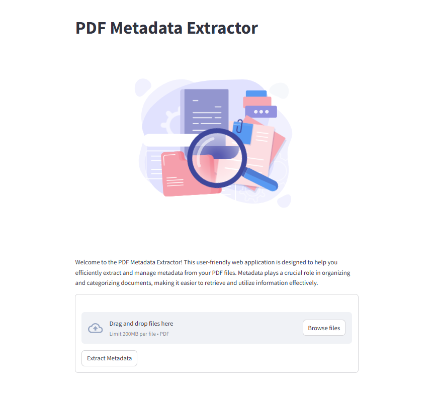

## PDF Metadata Extractor

Metadata plays a crucial role in organizing and categorizing documents, making it easier to retrieve and utilize information effectively.
This web application is designed to help you efficiently extract and manage metadata from your PDF files. 

#### Key Features:

1. Easy File Upload: Utilize a simple drag-and-drop interface to upload multiple PDF files at once. The application supports batch processing, allowing user to extract metadata from several documents in a single operation.
2. Comprehensive Metadata Extraction: Automatically extract essential metadata fields, including title, author, creation date, and modification date. This feature faciliate document organization and information management.
3. Downloadable Reports: After extraction, conveniently download the metadata as a CSV file. This feature is perfect for users who need to document their findings or perform further analysis on the extracted data.

#### How To Use:
1. Upload your PDF files using the file uploader.
2. Click 'Extract Metadata' to initiate the extraction process.
3. Once completed, download the metadata report in CSV format for easy access and analysis.

⏩ <a href="https://shihjen-pdf-metadataextractor-app-yzxcbw.streamlit.app/">Web Application</a>

🎥 <a href = " ">Dem Video</a>
